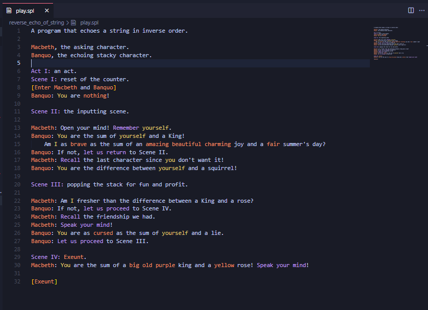

# A syntax highlighter for Shakespear Programming Language
When I started to program in this wonderful and crazy language I discovered there was no syntax higlighter.

So I created one! That's cool right?

> Probably it isn't totally formally correct in assigning parts 

## Installation
To install it, you need to copy the files to your VS Code extensions folder.

Depending on your platform, it is located in the following folders:
* Windows %`USERPROFILE%\.vscode\extensions`
* macOS `~/.vscode/extensions`
* Linux `~/.vscode/extensions`

> Please notice: visualisation and colours depends on your theme

### Thanks
Big thanks to [zmbc](https://github.com/zmbc) for his interpreter (and also for the grammars, although I saw them only after writing mine by hand).